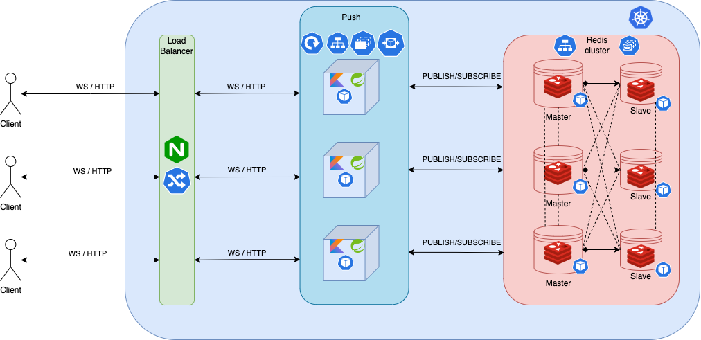
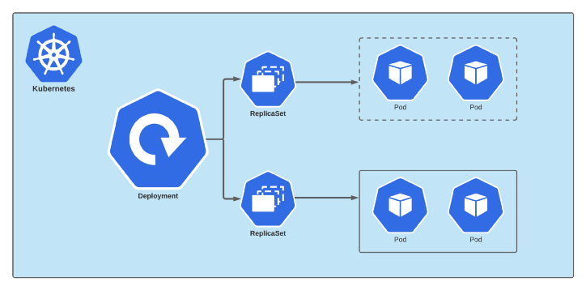
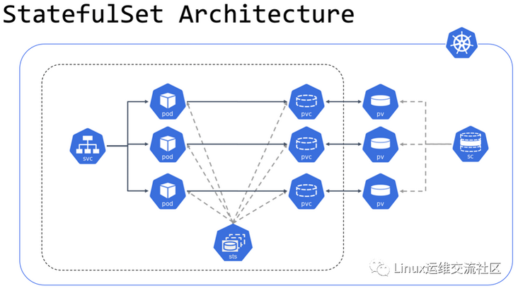

# Push
"Push" is a Real Time Reactive Push Messaging API highly inspired by [Netflix](https://github.com/Netflix) 's [Zuul Push](https://github.com/Netflix/zuul/wiki/Push-Messaging), but with some differences. It was written in [Kotlin](https://kotlinlang.org/) with the [Spring](https://spring.io/) framework and it uses [Redis](https://redis.io/) as a message broker. "Push" provides [WebSocket](https://developer.mozilla.org/en-US/docs/Web/API/WebSockets_API) and [Server-Sent Events](https://developer.mozilla.org/en-US/docs/Web/API/Server-sent_events/Using_server-sent_events) endpoints that can be used to subscribe to real-time messages in a web environment. It also provides an HTTP endpoint to publish messages.

## Architecture
"Push" was designed with the goal of being scalable and possibly used in a distributed environment, it uses [Redis](https://redis.io/) as message broker.

The following diagram demonstrates the architecture behind "Push" in a [Kubernetes](https://kubernetes.io/) environment, where we can create a cluster for [Redis](https://redis.io/) with master and slave nodes in order to have horizontal scalability and resiliency and also multiple instances of the application itself for the same purpose.

### Push Architecture
This section describes the architecture of "Push" through a component diagram.



### Deployment Architecture
"Push" takes advantage of the "Deployment" workload API from [Kubernetes](https://kubernetes.io/).
This section describes how it works under the hood.
A Deployment provides declarative updates for Pods and ReplicaSets and is used to tell Kubernetes how to create or modify instances of the pods that hold a containerized application. Deployments can scale the number of replica pods, enable rollout of updated code in a controlled manner, or roll back to an earlier deployment version if necessary.


### StatefulSet Architecture
"Push" makes use of the "StatefulSet" workload API to manage the [Redis](https://redis.io/) cluster.
This section describes how a kubernetes StatefulSet works under the hood.
StatefulSet is the workload API object used to manage stateful applications. It manages the deployment and scaling of a set of Pods, and provides guarantees about the ordering and uniqueness of these Pods. Similar to a Deployment, a StatefulSet manages Pods that are based on an identical container spec.


## Getting Started

Required software:
1. [`docker`](https://www.docker.com/products/docker-desktop/)
2. [`minikube`](https://minikube.sigs.k8s.io/docs/start/)
3. [`kubectl`](https://kubernetes.io/docs/tasks/tools/)

If you also want to compile the code directly on your machine you'll also need:
1. [`java 17`](https://www.oracle.com/java/technologies/javase/jdk17-archive-downloads.html)
2. [`gradle`](https://gradle.org/install/)

### Building from Source

To compile the code simply run
```bash
$ gradle clean build -x test -x compileAotMainJava
```

### Running Unit Tests

#### Locally
```bash
$ gradle clean build -x compileAotMainJava
```

#### With Docker
```bash
$ docker-compose -f docker-compose.test.yml build unit-tests && docker-compose -f docker-compose.test.yml run unit-tests
```

### Running Integration Tests

#### Locally
```bash
$ gradle clean build integrationTest -x compileAotMainJava
```

#### With Docker
```bash
$ docker-compose -f docker-compose.test.yml build integration-tests && docker-compose -f docker-compose.test.yml run integration-tests
```

// TODO complete

## To Do List
* [ ] Add unit and integration tests
* [ ] Write documentation
* [X] Dockerize application
* [X] Add observability and monitoring
* [X] Add heartbeats, timeouts and reconnection events to the SSE endpoint
* [X] Add ping-pongs, timeouts and reconnection events to the WS endpoint
* [X] Create [Kubernetes](https://kubernetes.io/) cluster with redundancy

## Improvements
* [ ] Automatically configure cluster for Redis
  * [ ] Configure horizontal pod autoscaler for Redis
* [ ] Configure horizontal pod autoscaler for Push based on custom metrics (e.g. throughput, number of concurrent connections, etc)
* [ ] Add [Sharded Pub/Sub](https://redis.io/docs/manual/pubsub/#sharded-pubsub) capacity
* [ ] Use [Terraform](https://www.terraform.io/) to deploy to Kubernetes
* [ ] Add "acks" to websockets messages
* [ ] Configure native compilation


## References
- https://github.com/rustudorcalin/deploying-redis-cluster
- https://www.vmware.com/topics/glossary/content/kubernetes-deployment.html
- https://kubernetes.io/docs/concepts/workloads/controllers/deployment/
- https://congdonglinux.com/rolling-updates-and-rollbacks-in-kubernetes/
- https://kubernetes.io/docs/concepts/workloads/controllers/statefulset/
- https://jayendrapatil.com/kubernetes-components/
